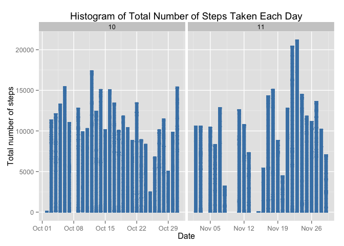
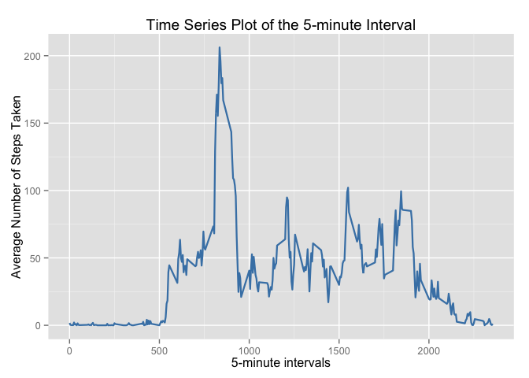
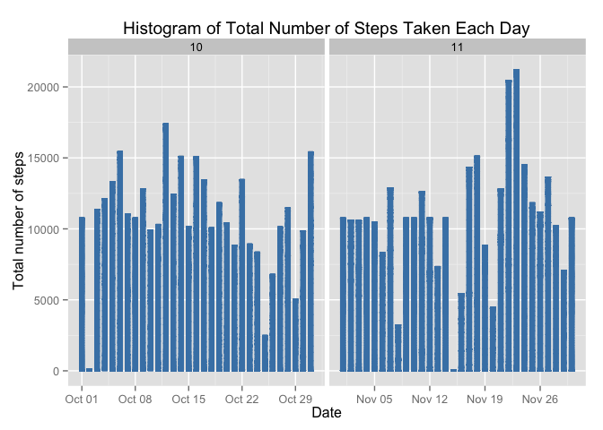

# Reproducible Research: Peer Assessment 1

## Global settings

```r
echo = TRUE
```

## Loading and preprocessing the data


```r
unzip("activity.zip")
data <- read.csv("activity.csv")
data$date <- as.Date(data$date)
data$month <- format(data$date, "%m")
data_na_rm <- na.omit(data)
rownames(data_na_rm) <- 1:nrow(data_na_rm)
head(data_na_rm)
```

```
##   steps       date interval month
## 1     0 2012-10-02        0    10
## 2     0 2012-10-02        5    10
## 3     0 2012-10-02       10    10
## 4     0 2012-10-02       15    10
## 5     0 2012-10-02       20    10
## 6     0 2012-10-02       25    10
```

```r
library(ggplot2)
```


## What is mean total number of steps taken per day?
For this part of the assignment, you can ignore the missing values in the dataset.

1. Calculate the total number of steps taken per day


```r
split_by_date <- split(data_na_rm$steps, data_na_rm$date)
total_steps <- sapply(split_by_date, sum)
total_steps
```

```
## 2012-10-02 2012-10-03 2012-10-04 2012-10-05 2012-10-06 2012-10-07 
##        126      11352      12116      13294      15420      11015 
## 2012-10-09 2012-10-10 2012-10-11 2012-10-12 2012-10-13 2012-10-14 
##      12811       9900      10304      17382      12426      15098 
## 2012-10-15 2012-10-16 2012-10-17 2012-10-18 2012-10-19 2012-10-20 
##      10139      15084      13452      10056      11829      10395 
## 2012-10-21 2012-10-22 2012-10-23 2012-10-24 2012-10-25 2012-10-26 
##       8821      13460       8918       8355       2492       6778 
## 2012-10-27 2012-10-28 2012-10-29 2012-10-30 2012-10-31 2012-11-02 
##      10119      11458       5018       9819      15414      10600 
## 2012-11-03 2012-11-05 2012-11-06 2012-11-07 2012-11-08 2012-11-11 
##      10571      10439       8334      12883       3219      12608 
## 2012-11-12 2012-11-13 2012-11-15 2012-11-16 2012-11-17 2012-11-18 
##      10765       7336         41       5441      14339      15110 
## 2012-11-19 2012-11-20 2012-11-21 2012-11-22 2012-11-23 2012-11-24 
##       8841       4472      12787      20427      21194      14478 
## 2012-11-25 2012-11-26 2012-11-27 2012-11-28 2012-11-29 
##      11834      11162      13646      10183       7047
```


2. Make a histogram of the total number of steps taken each day

```r
ggplot(data_na_rm, aes(date, steps)) + geom_bar(stat = "identity", col = "steelblue", fill = "steelblue", width = 0.6) + facet_grid(. ~ month, scales = "free_x") + labs(title = "Histogram of Total Number of Steps Taken Each Day" , x = "Date", y = "Total number of steps")
```

 

3. Calculate and report the mean and median of the total number of steps taken per day

Mean of total number of steps taken per day:

```r
totalSteps <- aggregate(data_na_rm$steps, list(Date = data_na_rm$date), FUN = "sum")$x
mean(totalSteps)
```

```
## [1] 10766.19
```
Median of total number of steps taken per day:

```r
median(totalSteps)
```

```
## [1] 10765
```

## What is the average daily activity pattern?
1. Make a time series plot (i.e. type = "l") of the 5-minute interval (x-axis) and the average number of steps taken, averaged across all days (y-axis)


```r
avg_steps <- aggregate(data_na_rm$steps, list(interval = as.numeric(data_na_rm$interval)), FUN = "mean")
names(avg_steps)[2] <- "meanOfSteps"

ggplot(avg_steps, aes(interval, meanOfSteps)) + geom_line(color = "steelblue", size = 0.8) + labs(title = "Time Series Plot of the 5-minute Interval", x = "5-minute intervals", y = "Average Number of Steps Taken")
```

 


2. Which 5-minute interval, on average across all the days in the dataset, contains the maximum number of steps?

```r
avg_steps[avg_steps$meanOfSteps == max(avg_steps$meanOfSteps), ]
```

```
##     interval meanOfSteps
## 104      835    206.1698
```


## Imputing missing values
1. Calculate and report the total number of missing values in the dataset (i.e. the total number of rows with NAs)


```r
sum(is.na(data))
```

```
## [1] 2304
```
2. Devise a strategy for filling in all of the missing values in the dataset. The strategy does not need to be sophisticated. For example, you could use the mean/median for that day, or the mean for that 5-minute interval, etc.

   Here I use the mean for that 5-minute interval for filling in all of the mission values.


3. Create a new dataset that is equal to the original dataset but with the missing data filled in.


```r
filled_data <- data 
for (i in 1:nrow(filled_data)) {
    if (is.na(filled_data$steps[i])) {
        filled_data$steps[i] <- avg_steps[which(filled_data$interval[i] == avg_steps$interval), ]$meanOfSteps
    }
}

head(filled_data)
```

```
##       steps       date interval month
## 1 1.7169811 2012-10-01        0    10
## 2 0.3396226 2012-10-01        5    10
## 3 0.1320755 2012-10-01       10    10
## 4 0.1509434 2012-10-01       15    10
## 5 0.0754717 2012-10-01       20    10
## 6 2.0943396 2012-10-01       25    10
```

```r
sum(is.na(filled_data))
```

```
## [1] 0
```

4. Make a histogram of the total number of steps taken each day and Calculate and report the mean and median total number of steps taken per day. Do these values differ from the estimates from the first part of the assignment? What is the impact of imputing missing data on the estimates of the total daily number of steps?


```r
ggplot(filled_data, aes(date, steps)) + geom_bar(stat = "identity", colour = "steelblue", fill = "steelblue", width = 0.6) + facet_grid(. ~ month, scales = "free") + labs(title = "Histogram of Total Number of Steps Taken Each Day", x = "Date", y = "Total number of steps")
```

 

Mean of total number of steps taken per day:

```r
newTotalSteps <- aggregate(filled_data$steps, 
                           list(Date = filled_data$date), 
                           FUN = "sum")$x
newMean <- mean(newTotalSteps)
newMean
```

```
## [1] 10766.19
```
Median of total number of steps taken per day:

```r
newMedian <- median(newTotalSteps)
newMedian
```

```
## [1] 10766.19
```
Compare the data with and without missing data:

```r
oldMean <- mean(totalSteps)
oldMedian <- median(totalSteps)
newMean - oldMean
```

```
## [1] 0
```

```r
newMedian - oldMedian
```

```
## [1] 1.188679
```
By imputing the missing data, the new mean of total steps taken per day is the same as that of the old mean; the new median of total steps taken per day is greater than that of the old median.


## Are there differences in activity patterns between weekdays and weekends ?

1. Create a new factor variable in the dataset with two levels – “weekday” and “weekend” indicating whether a given date is a weekday or weekend day.


```r
head(filled_data)
```

```
##       steps       date interval month
## 1 1.7169811 2012-10-01        0    10
## 2 0.3396226 2012-10-01        5    10
## 3 0.1320755 2012-10-01       10    10
## 4 0.1509434 2012-10-01       15    10
## 5 0.0754717 2012-10-01       20    10
## 6 2.0943396 2012-10-01       25    10
```

```r
filled_data$weekdays <- factor(format(filled_data$date, "%A"))
levels(filled_data$weekdays)
```

```
## [1] "Friday"    "Monday"    "Saturday"  "Sunday"    "Thursday"  "Tuesday"  
## [7] "Wednesday"
```

```r
levels(filled_data$weekdays) <- list(weekday = c("Monday", "Tuesday","Wednesday","Thursday", "Friday"), weekend = c("Saturday", "Sunday"))
levels(filled_data$weekdays)
```

```
## [1] "weekday" "weekend"
```

```r
table(filled_data$weekdays)
```

```
## 
## weekday weekend 
##   12960    4608
```


2. Make a panel plot containing a time series plot (i.e. type = "l") of the 5-minute interval (x-axis) and the average number of steps taken, averaged across all weekday days or weekend days (y-axis).


```r
avg_steps <- aggregate(filled_data$steps, 
                      list(interval = as.numeric(filled_data$interval), 
                           weekdays = filled_data$weekdays),
                      FUN = "mean")
names(avg_steps)[3] <- "meanOfSteps"
library(lattice)
xyplot(avg_steps$meanOfSteps ~ avg_steps$interval | avg_steps$weekdays, 
       layout = c(1, 2), type = "l", 
       xlab = "Interval", ylab = "Number of steps")
```

 

